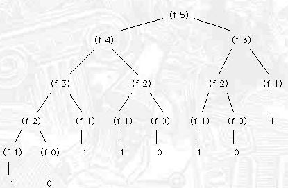

# Fabonacci

## Recursive Approach
    * Uses recursive approach to find the nth fabonacci number.
    * For nth no. calculation is done using (n - 1) + (n - 2)
    * Which does repetitive calculation for some element i.

## Dynamic Programming
    * Stores every calculation into an array and uses previous value to calculate next one instead of recalculating everthing